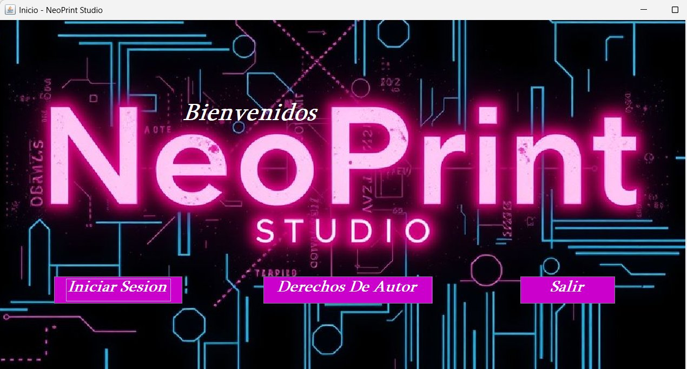
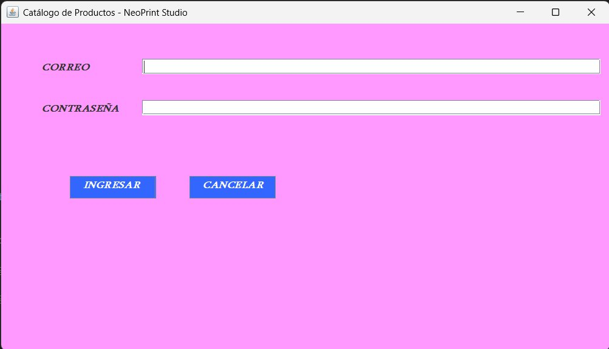
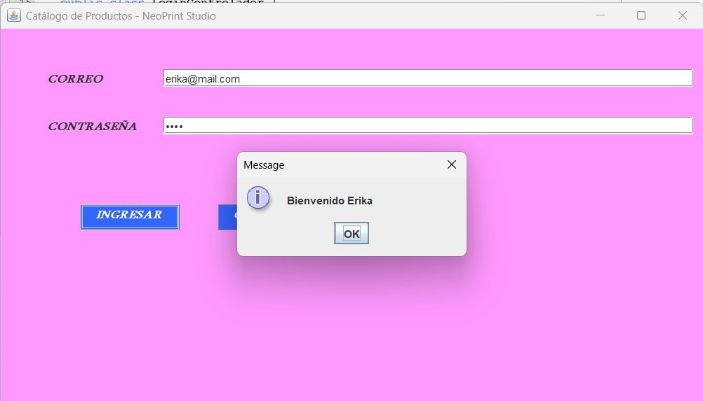
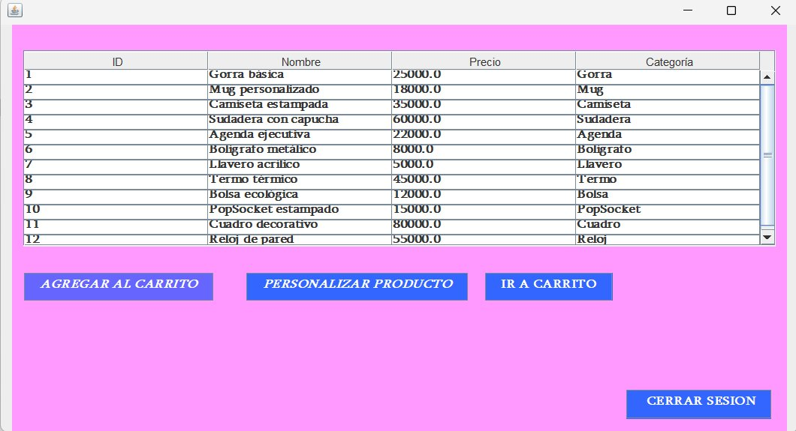
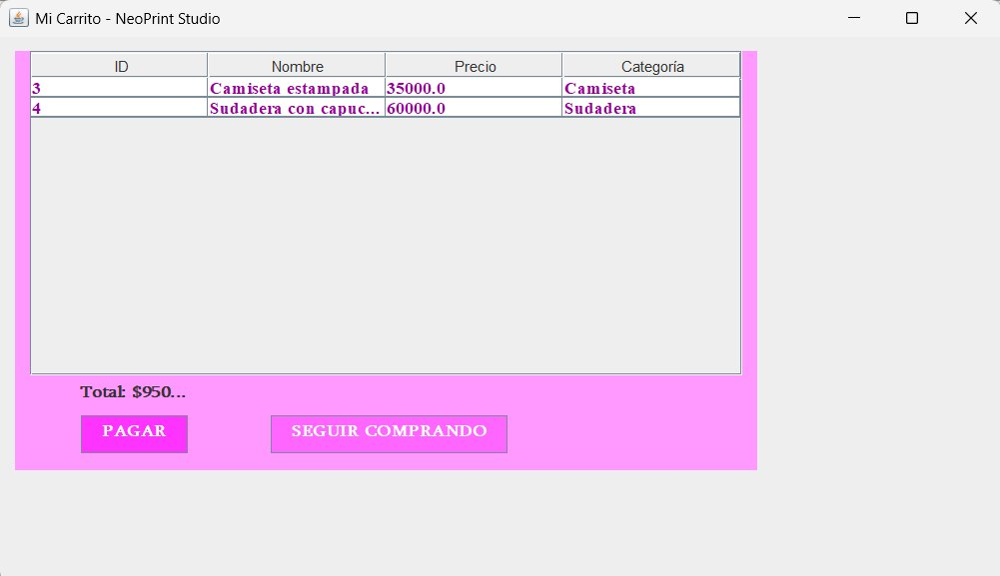

# App_Impresiones — NeoPrint Studio

## Descripción
**NeoPrint Studio** es una aplicación de escritorio desarrollada en Java que permite gestionar una tienda de productos personalizados. Los usuarios pueden iniciar sesión, explorar el catálogo de productos (gorras, mugs, camisetas, sudaderas y más) y agregar artículos a un carrito de compras.

El proyecto fue desarrollado en **NetBeans 20** utilizando la arquitectura **Modelo-Vista-Controlador (MVC)** con conexión a base de datos **Microsoft SQL Server**.

## Tecnologías utilizadas
- Java (Swing / Desktop)
- Maven
- Microsoft SQL Server
- NetBeans 20

## Funcionalidades
- Pantalla de bienvenida con acceso al sistema
- Inicio de sesión con validación desde base de datos
- Cierre de sesión
- Catálogo de productos con ID, nombre, precio y categoría
- Agregar productos al carrito
- Personalizar productos
- Carrito de compras con total y opción de pago

## Estructura del proyecto (MVC)
```
src/main/java/com/mycompany/app_impreciones/
├── controlador/
│   ├── LoginControlador.java
│   ├── InicioControlador.java
│   ├── PagoControlador.java
│   ├── PedidoControlador.java
│   └── ProductoControlador.java
├── modelo/
│   ├── Producto.java
│   ├── Usuario.java
│   ├── Carrito.java
│   ├── Gorra.java
│   └── Mug.java
├── dao/
│   ├── ProductoDAO.java
│   └── UsuarioDAO.java
└── util/
    └── ConexionBD.java
```

## Capturas de pantalla

### Pantalla de Inicio


### Inicio de Sesión


### Login Exitoso


### Catálogo de Productos


### Carrito de Compras


## Cómo ejecutar el proyecto
1. Clona el repositorio
2. Abre el proyecto en NetBeans 20
3. Configura la conexión a SQL Server en `ConexionBD.java`
4. Ejecuta el script `SQLQuery2.sql` para crear la base de datos
5. Compila y ejecuta la aplicación

## Autora
**Erika Ramírez** — [@erikaramirezm0221-netizen](https://github.com/erikaramirezm0221-netizen)
